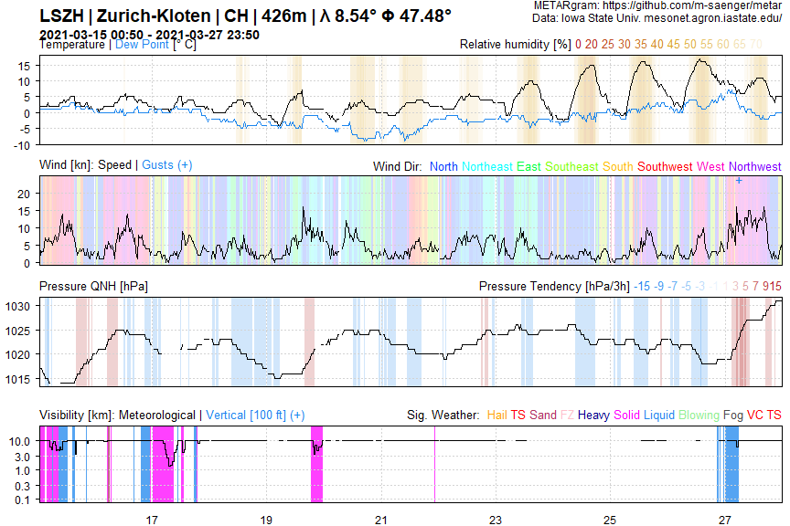

<!-- README.md is generated from README.Rmd. Please edit that file -->

# metar

The goal of **metar** is to provide an R-built parser for METAR reports.
Find more information about METAR under
<https://en.wikipedia.org/wiki/METAR>

## Installation

Install the development version from
[GitHub](https://github.com/m-saenger/metar) with:

``` r
# install.packages("devtools") 
devtools::install_github("m-saenger/metar", upgrade = "never")
```

Install the latest stable version from
[GitHub](https://github.com/m-saenger/metar/tags) with:

``` r
# install.packages("devtools") 
devtools::install_github("m-saenger/metar@0.9.0", upgrade = "never")
```

This package depends on **data.table**, **stringr**, **readr** and
**lubridate**.

## Example

### Data retrieval and parsing

``` r
library(metar)

## read raw data from Mesonet website
dat <- read_metar_mesonet("LSZH", date_start = "2021-03-15", date_end = "2021-03-28")

## parse METAR code
dat.parsed <- parse_metar(x = dat$metar, t = dat$valid)
#> Warning in eval(jsub, SDenv, parent.frame()): NAs introduced by coercion

# Structure  (subset of columns)
print(dat.parsed[1:10, .(metar, tt, qnh)])
#>                                                                                                   metar
#>  1:                     LSZH 150050Z 25005KT 220V280 9999 FEW008 BKN012 02/01 Q1017 TEMPO SHSNRA BKN009
#>  2:                             LSZH 150120Z VRB02KT 9999 FEW008 BKN010 02/01 Q1017 TEMPO SHSNRA BKN009
#>  3: LSZH 150150Z 19003KT 120V230 9999 -SHSNRA FEW007 SCT011 BKN016 02/01 Q1017 RESN TEMPO SHSNRA BKN009
#>  4:              LSZH 150220Z VRB03KT 9999 -SHSNRA FEW007 SCT012 BKN017 02/01 Q1016 TEMPO SHSNRA BKN009
#>  5:         LSZH 150250Z 21005KT 9999 -SHSNRA FEW011 SCT014 BKN019 02/01 Q1016 RESN TEMPO SHSNRA BKN009
#>  6:              LSZH 150320Z 22007KT 9999 -SHSNRA FEW009 SCT015 BKN060 02/01 Q1015 TEMPO SHSNRA BKN009
#>  7:                    LSZH 150350Z 20006KT 9999 FEW010 BKN013 02/01 Q1015 RESHSNRA TEMPO SHSNRA BKN009
#>  8:         LSZH 150420Z 22006KT 9999 -SHSNRA FEW009 SCT012 BKN017 03/01 Q1015 RESN TEMPO SHSNRA BKN009
#>  9:                     LSZH 150450Z 22007KT 9999 -SHSNRA FEW009 BKN012 02/01 Q1014 TEMPO SHSNRA BKN009
#> 10:          LSZH 150520Z 22006KT 180V280 6000 -RASN BKN010 BKN015 02/01 Q1014 RESN TEMPO SHSNRA BKN009
#>     tt  qnh
#>  1:  2 1017
#>  2:  2 1017
#>  3:  2 1017
#>  4:  2 1016
#>  5:  2 1016
#>  6:  2 1015
#>  7:  2 1015
#>  8:  3 1015
#>  9:  2 1014
#> 10:  2 1014
```

### Variable names

``` r
library(data.table)
#> Warning: package 'data.table' was built under R version 4.0.4
# Structure  (subset of columns and rows)
print(metar.para[1:10, .(id_para, name_para)])
#>         id_para            name_para
#>  1:         cld        Cloud Section
#>  2:     cld_amt         Cloud Amount
#>  3:    cld_octa          Cloud Octas
#>  4:     cld_hgt         Cloud Height
#>  5: cld_hgt_min Cloud Height Minimum
#>  6: cld_hgt_max Cloud Height Maximum
#>  7:    cld_type           Cloud Type
#>  8:     ceiling              Ceiling
#>  9:        auto                 AUTO
#> 10:         cor           Correction
```

### Example plot

``` r
library(ggplot2)
#> Warning: package 'ggplot2' was built under R version 4.0.4
ggplot(dat.parsed, aes(time, tt)) +
  geom_path() +
  labs(title = "Recent Temperature at LSZH Airport") +
  theme_bw()
```


### Data processing (cloud groups)

``` r
# Process cloud groups (1-4)
dat.cld <- parse_metar_cld(dat.parsed$cld)    
dat.cld$time <- dat.parsed$time

# Structure (subset of columns)
print(dat.cld[1:10, .(time, cld_lay,  cld_amt_1, cld_hgt_1, cld_type_1 )])
#>                    time cld_lay cld_amt_1 cld_hgt_1 cld_type_1
#>  1: 2021-03-15 00:50:00       2       FEW         8       <NA>
#>  2: 2021-03-15 01:20:00       2       FEW         8       <NA>
#>  3: 2021-03-15 01:50:00       3       FEW         7       <NA>
#>  4: 2021-03-15 02:20:00       3       FEW         7       <NA>
#>  5: 2021-03-15 02:50:00       3       FEW        11       <NA>
#>  6: 2021-03-15 03:20:00       3       FEW         9       <NA>
#>  7: 2021-03-15 03:50:00       2       FEW        10       <NA>
#>  8: 2021-03-15 04:20:00       3       FEW         9       <NA>
#>  9: 2021-03-15 04:50:00       2       FEW         9       <NA>
#> 10: 2021-03-15 05:20:00       2       BKN        10       <NA>

ggplot(dat.cld, aes(time, cld_hgt_1)) +
  geom_path() +
  labs(title = "Altitude of Lowest Cloud Level at LSZH Airport") +
  theme_bw()
```


### METARgram - Timeseries

``` r
# Parse present weather group
dat.pw <- dat.parsed[, parse_metar_pw(pw)]

# Structure (subset of columns)
print(dat.pw[1:10, .(pw_grp_1, pw_grp_2, PP_SOLID, PP_LIQUID, sigwx)])
#>     pw_grp_1 pw_grp_2 PP_SOLID PP_LIQUID    sigwx
#>  1:     <NA>     <NA>        0         0    NOSIG
#>  2:     <NA>     <NA>        0         0    NOSIG
#>  3:  -SHSNRA     <NA>        1         1 PP_SOLID
#>  4:  -SHSNRA     <NA>        1         1 PP_SOLID
#>  5:  -SHSNRA     <NA>        1         1 PP_SOLID
#>  6:  -SHSNRA     <NA>        1         1 PP_SOLID
#>  7:     <NA>     <NA>        0         0    NOSIG
#>  8:  -SHSNRA     <NA>        1         1 PP_SOLID
#>  9:  -SHSNRA     <NA>        1         1 PP_SOLID
#> 10:    -RASN     <NA>        1         1 PP_SOLID

# Bind data
dat.plot <- cbind(dat.parsed, dat.pw)

plot_metargram(dat = dat.plot)
```


