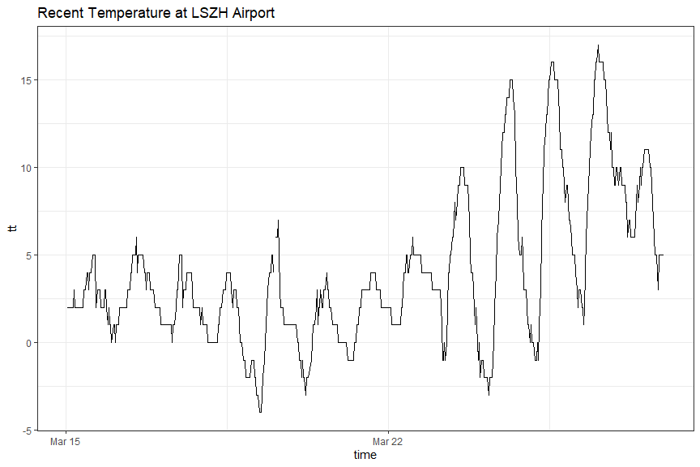
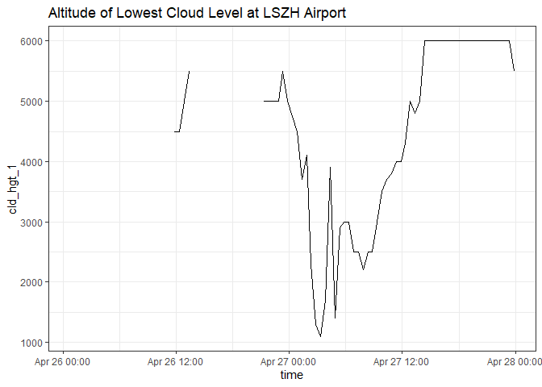

<!-- README.md is generated from README.Rmd. Please edit that file -->

# metar

The goal of **metar** is to provide an R-built parser for METAR reports.

## Installation

Install the development version from [GitHub](https://github.com/) with:

``` r
# install.packages("devtools") 
devtools::install_github("m-saenger/metar")
```

## Example

### Data retrieval and parsing

``` r
library(metar)

## read raw data from Mesonet website
dat <- read_mesonet("LSZH", as.POSIXct("2021-03-26"), as.POSIXct("2021-03-28"))

## parse METAR code
dat.parsed <- parse_metar(dat$metar)

# Structure
str(dat.parsed)
#> Classes 'data.table' and 'data.frame':   94 obs. of  35 variables:
#>  $ icao       : chr  "LSZH" "LSZH" "LSZH" "LSZH" ...
#>  $ time       : POSIXct, format: "2021-04-26 00:50:00" "2021-04-26 01:20:00" ...
#>  $ speci      : chr  "0" "0" "0" "0" ...
#>  $ auto       : chr  "0" "0" "0" "0" ...
#>  $ cor        : chr  "0" "0" "0" "0" ...
#>  $ wx         : chr  "CAVOK" "CAVOK" "CAVOK" "CAVOK" ...
#>  $ dir        : int  NA NA NA NA 150 160 160 170 130 20 ...
#>  $ ff         : num  1 2 1 1 3 4 5 5 2 2 ...
#>  $ fx         : num  NA NA NA NA NA NA NA NA NA NA ...
#>  $ ff_unit    : chr  "KT" "KT" "KT" "KT" ...
#>  $ dir_from   : int  NA NA NA NA NA NA NA NA NA NA ...
#>  $ dir_to     : int  NA NA NA NA NA NA NA NA NA NA ...
#>  $ vis        : num  9999 9999 9999 9999 9999 ...
#>  $ vis_unit   : chr  "M" "M" "M" "M" ...
#>  $ ndv        : chr  NA NA NA NA ...
#>  $ min_vis    : int  NA NA NA NA NA NA NA NA NA NA ...
#>  $ min_vis_dir: chr  NA NA NA NA ...
#>  $ rvr        : chr  "" "" "" "" ...
#>  $ vvis       : num  NA NA NA NA NA NA NA NA NA NA ...
#>  $ cld        : chr  "" "" "" "" ...
#>  $ tt_sign    : chr  "P" "P" "P" "P" ...
#>  $ tt         : num  5 5 4 3 2 3 3 3 2 2 ...
#>  $ td_sign    : chr  "P" "P" "P" "P" ...
#>  $ td         : num  1 2 1 1 0 1 1 0 0 1 ...
#>  $ pw         : chr  "" "" "" "" ...
#>  $ qnh_unit   : chr  "Q" "Q" "Q" "Q" ...
#>  $ qnh        : num  1023 1023 1022 1022 1022 ...
#>  $ ws         : chr  NA NA NA NA ...
#>  $ metar      : chr  "VRB01KT CAVOK 05/01 Q1023 NOSIG" "VRB02KT CAVOK 05/02 Q1023 NOSIG" "VRB01KT CAVOK 04/01 Q1022 NOSIG" "VRB01KT CAVOK 03/01 Q1022 NOSIG" ...
#>  $ rmk        : chr  NA NA NA NA ...
#>  $ wind_factor: num  1 1 1 1 1 1 1 1 1 1 ...
#>  $ vis_factor : num  1 1 1 1 1 1 1 1 1 1 ...
#>  $ qnh_factor : num  1 1 1 1 1 1 1 1 1 1 ...
#>  $ tt_factor  : num  1 1 1 1 1 1 1 1 1 1 ...
#>  $ td_factor  : num  1 1 1 1 1 1 1 1 1 1 ...
#>  - attr(*, ".internal.selfref")=<externalptr>
```

### Example plot

``` r
library(ggplot2)
#> Warning: package 'ggplot2' was built under R version 4.0.4
ggplot(dat.parsed, aes(time, tt)) +
  geom_path() +
  labs(title = "Recent Temperature at LSZH Airport") +
  theme_bw()
```



### Data processing (cloud groups)

``` r
# Process cloud groups (1-4)
dat.cld <- metar_clouds(dat.parsed$cl)    
dat.cld$time <- dat.parsed$time

# Structure
str(dat.cld)
#> Classes 'data.table' and 'data.frame':   94 obs. of  19 variables:
#>  $ cld_levels : int  NA NA NA NA NA NA NA NA NA NA ...
#>  $ cld_hgt_min: num  NA NA NA NA NA NA NA NA NA NA ...
#>  $ cld_hgt_max: num  NA NA NA NA NA NA NA NA NA NA ...
#>  $ cld_amt_max: chr  NA NA NA NA ...
#>  $ cld_amt_min: chr  NA NA NA NA ...
#>  $ ceiling    : num  NA NA NA NA NA NA NA NA NA NA ...
#>  $ cld_str_1  : chr  NA NA NA NA ...
#>  $ cld_str_2  : chr  NA NA NA NA ...
#>  $ cld_str_3  : chr  NA NA NA NA ...
#>  $ cld_amt_1  : chr  NA NA NA NA ...
#>  $ cld_amt_2  : chr  NA NA NA NA ...
#>  $ cld_amt_3  : chr  NA NA NA NA ...
#>  $ cld_hgt_1  : num  NA NA NA NA NA NA NA NA NA NA ...
#>  $ cld_hgt_2  : num  NA NA NA NA NA NA NA NA NA NA ...
#>  $ cld_hgt_3  : num  NA NA NA NA NA NA NA NA NA NA ...
#>  $ cld_type_1 : chr  NA NA NA NA ...
#>  $ cld_type_2 : chr  NA NA NA NA ...
#>  $ cld_type_3 : chr  NA NA NA NA ...
#>  $ time       : POSIXct, format: "2021-04-26 00:50:00" "2021-04-26 01:20:00" ...
#>  - attr(*, ".internal.selfref")=<externalptr>

ggplot(dat.cld, aes(time, cld_hgt_1)) +
  geom_path() +
  labs(title = "Altitude of Lowest Cloud Level at LSZH Airport") +
  theme_bw()
#> Warning: Removed 22 row(s) containing missing values (geom_path).
```


